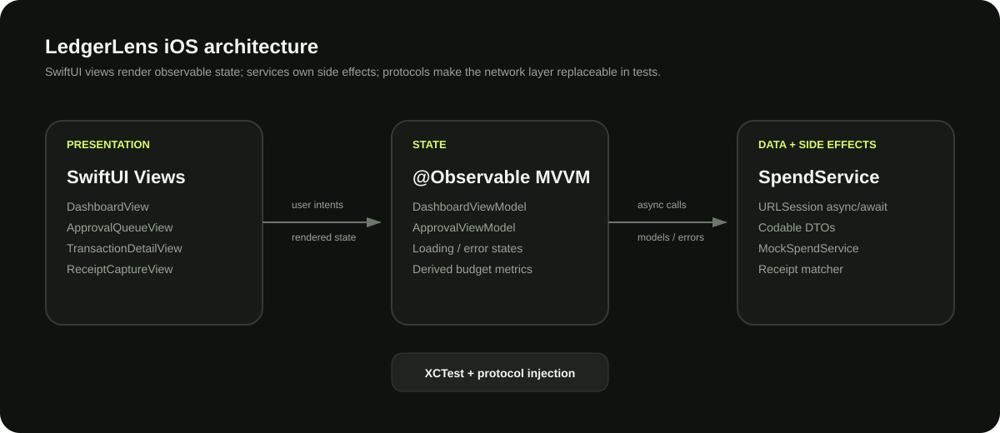

# LedgerLens

<p align="center"></p>

<p align="center">
  
  
  
  
</p>

**LedgerLens is an iPhone-first spend operations app for card activity, receipts, policy review, approvals, and budget intelligence.**

The repository contains two surfaces backed by the same product model:

- a native **Swift + SwiftUI** application designed for iOS 17+
- a browser-based interactive product demo so the workflow can be evaluated without Xcode

**Live demo:** https://nehamahesh.github.io/projects/ledgerlens/

---

## Product flow

```text
card transaction
      │
      ├── receipt attached ───────────────► complete
      │
      └── receipt missing
              │
              ▼
        capture / match receipt
              │
              ▼
          policy signal
              │
       ┌──────┴──────┐
       │             │
  auto-approved   reviewer queue
                         │
                   approve / deny
```

The home surface is intentionally operational rather than analytical: current spend, remaining budget, and recent activity appear first. Approvals and deeper spend trends are one tap away.

## Native iOS implementation

### SwiftUI

The interface is built with declarative SwiftUI views and standard platform navigation primitives:

- `TabView` for top-level information architecture
- `NavigationStack` for drill-down flows
- `List` / `LazyVStack` for transaction and approval queues
- `sheet(item:)` for receipt capture
- `ProgressView` for budget utilization
- `Charts` for spend trends

### MVVM + Observation

`DashboardViewModel` and `ApprovalViewModel` own UI-facing state. Views send intents; view models coordinate services; services own side effects.

```text
SwiftUI View
    │ user intent
    ▼
@Observable ViewModel
    │ await
    ▼
SpendService protocol
    ├── DemoSpendService
    └── NetworkSpendService
            │
         URLSession
```

This keeps loading, error, approval, and receipt state testable without networking.

### Structured concurrency

Dashboard loading fans out independent work concurrently:

```swift
async let transactions = service.transactions()
async let summary = service.summary()
self.transactions = try await transactions
self.summary = try await summary
```

Approval decisions are asynchronous and scoped per request so one in-flight action does not freeze the queue.

### Networking

`NetworkSpendService` uses `URLSession.data(from:)` / `data(for:)`, `Codable`, ISO-8601 dates, typed errors, and a protocol boundary that can be replaced by mocks.

### Receipt state

The demo receipt flow models a common mobile finance operation: capture a document, match it against an existing transaction, then update the transaction from `required` to `attached`. The browser demo simulates OCR/matching while the native view models the same state transition.

## Repository structure

```text
projects/ledgerlens/
├── index.html
├── styles.css
├── app.js
├── assets/
│   └── architecture.svg
├── project.yml
└── ios/
    ├── LedgerLens/
    │   ├── LedgerLensApp.swift
    │   ├── Models/
    │   ├── Services/
    │   ├── ViewModels/
    │   └── Views/
    └── LedgerLensTests/
```

## Run the iOS app

Requirements:

- macOS with Xcode 16+
- XcodeGen (`brew install xcodegen`)

From this directory:

```bash
xcodegen generate
open LedgerLens.xcodeproj
```

Select an iPhone simulator and run the `LedgerLens` target. The app uses `DemoSpendService` by default, so no keys, accounts, or backend setup are required.

## Switch to a real API

`SpendService` is the seam between UI state and data. Replace the demo dependency in `LedgerLensApp.swift`:

```swift
let service = NetworkSpendService(
    baseURL: URL(string: "https://api.example.com/v1/")!
)
```

Expected resources:

```text
GET   /transactions
GET   /approvals
GET   /summary
PATCH /approvals/{id}
```

The models are `Codable`, so the same service layer can be connected to a REST backend without rewriting the UI.

## Test coverage

`DashboardViewModelTests` verifies the two state transitions that matter most to the home experience:

1. asynchronous dashboard loading resolves into transactions + summary data
2. receipt attachment mutates only the selected transaction

The service protocol also makes failure-path and approval tests straightforward to add with deterministic mocks.

## Design notes

The visual system uses a near-black base with a single high-contrast chartreuse accent. The goal is to keep financial information dense but calm: amount hierarchy is strong, status text is quiet until action is required, and approval cards place policy context before the decision buttons.

The browser demo intentionally mirrors iPhone proportions and interaction hierarchy rather than pretending to be the native application. It exists so the product can be explored from any device while the SwiftUI implementation remains the source of truth for mobile architecture.
